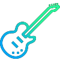

<!-- PROJECT SHIELDS -->
[![Contributors][contributors-shield]][contributors-url]
[![Stargazers][stars-shield]][stars-url]
[![Issues][issues-shield]][issues-url]
[![MIT License][license-shield]][license-url]
[![LinkedIn][linkedin-shield]][linkedin-url]

<!-- PROJECT LOGO -->
 

  

  <h3 align="center">Guitar controller - USB & wireless (multi-platform)</h3>

  

    Guitar controller to rock! [Wii | Xbox | PS | PC]
     
     
    <a href="https://github.com/MarcAndreJean/rockband-guitar-usb-and-xbox-rf-module/issues">Report Bug</a>
    ·
    <a href="https://github.com/MarcAndreJean/rockband-guitar-usb-and-xbox-rf-module/issues">Request Feature</a>
  

<!-- TABLE OF CONTENTS -->

  
Table of Contents

  <ol>
    <li><a href="#about-the-project">About The Project</a></li>
    <li><a href="#roadmap">Roadmap</a></li>
    <li><a href="#license">License</a></li>
    <li><a href="#contact">Contact</a></li>
    <li><a href="#acknowledgments">Acknowledgments</a></li>
  </ol>

<!-- ABOUT THE PROJECT -->
## About The Project

<!--[![Product Name Screen Shot][product-screenshot]](https://example.com)-->

To feed

(<a href="#top">back to top</a>)

<!-- ROADMAP -->
## Roadmap

V0.1
- [ ] Mini-controller code
  - [ ] Reproduce mini-controller with an arduino (receive inputs)
  - [ ]  Send output to USB (xbox and pc)

V0.2
- [ ] Body Parts
  - [ ] Prototype whammy
  - [ ] Prototype strum
  - [ ] Prototype boost
  - [ ] Prototype default button (back, start, A, B, X, Y, Up, Down, Bottom, Left, Right)
  - [ ] Prototype controller number (4 leds) + menu button
  - [ ] Prototype effect selector (ez)

V0.3
- [ ] Neck Parts
  - [ ] Prototype one fret button
  - [ ] Prototype guitar fret with 5 frets

V0.4
- [ ] Guitar
  - [ ] Prototype guitar body
  - [ ] Prototype guitar neck
  - [ ] Full prototype assembly

V1
- [ ] Guitar body
- [ ] Guitar neck
- [ ] First assembly

V2
- [ ] Custom mini-controller

See the [open issues](https://github.com/MarcAndreJean/rockband-guitar-usb-and-xbox-rf-module/issues) for a full list of proposed features (and known issues).

(<a href="#top">back to top</a>)

<!-- LICENSE -->
## License

Distributed under the MIT License. See `LICENSE.txt` for more information.

(<a href="#top">back to top</a>)

<!-- CONTACT -->
## Contact

Marc-André Jean - [@MkII_4ndr3](https://twitter.com/MkII_4ndr3) - the.mapaq@gmail.com

Project Link: [https://github.com/MarcAndreJean/rockband-guitar-usb-and-xbox-rf-module](https://github.com/MarcAndreJean/rockband-guitar-usb-and-xbox-rf-module)

(<a href="#top">back to top</a>)

<!-- ACKNOWLEDGMENTS -->
## Acknowledgments

<!--* [Choose an Open Source License](https://choosealicense.com)-->

(<a href="#top">back to top</a>)

<!-- MARKDOWN LINKS & IMAGES -->
<!-- https://www.markdownguide.org/basic-syntax/#reference-style-links -->
[contributors-shield]: https://img.shields.io/github/contributors/MarcAndreJean/rockband-guitar-usb-and-xbox-rf-module.svg?style=for-the-badge
[contributors-url]: https://github.com/MarcAndreJean/rockband-guitar-usb-and-xbox-rf-module/graphs/contributors
[forks-shield]: https://img.shields.io/MarcAndreJean/rockband-guitar-usb-and-xbox-rf-module.svg?style=for-the-badge
[forks-url]: https://github.com/MarcAndreJean/rockband-guitar-usb-and-xbox-rf-module/network/members
[stars-shield]: https://img.shields.io/github/stars/MarcAndreJean/rockband-guitar-usb-and-xbox-rf-module.svg?style=for-the-badge
[stars-url]: https://github.com/MarcAndreJean/rockband-guitar-usb-and-xbox-rf-module/stargazers
[issues-shield]: https://img.shields.io/github/issues/MarcAndreJean/rockband-guitar-usb-and-xbox-rf-module.svg?style=for-the-badge
[issues-url]: https://github.com/MarcAndreJean/rockband-guitar-usb-and-xbox-rf-module/issues
[license-shield]: https://img.shields.io/github/license/MarcAndreJean/rockband-guitar-usb-and-xbox-rf-module.svg?style=for-the-badge
[license-url]: https://github.com/MarcAndreJean/rockband-guitar-usb-and-xbox-rf-module/blob/master/LICENSE.txt
[linkedin-shield]: https://img.shields.io/badge/-LinkedIn-black.svg?style=for-the-badge&logo=linkedin&colorB=555
[linkedin-url]: https://www.linkedin.com/in/marc-andr%C3%A9-jean
[product-screenshot]: images/screenshot.png
